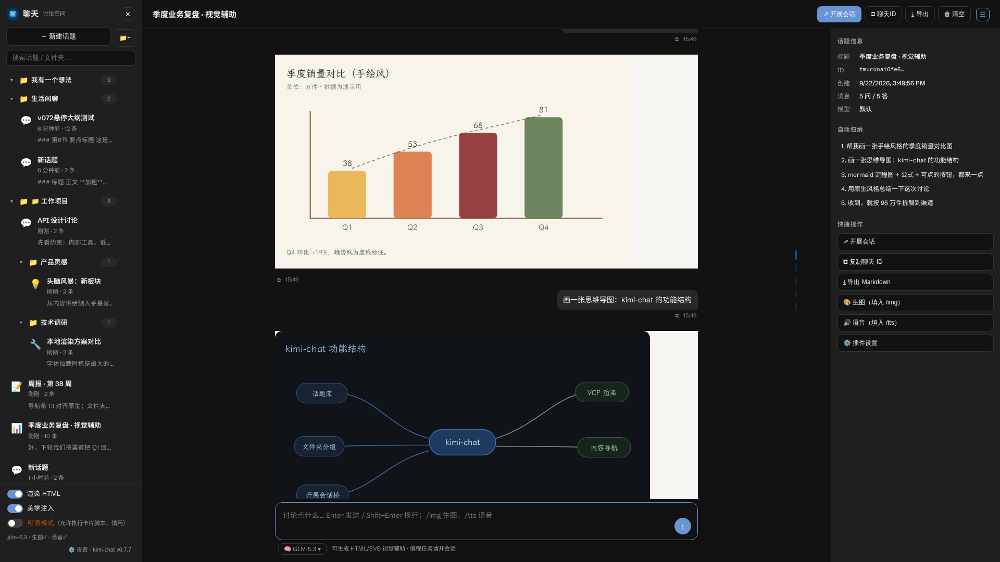
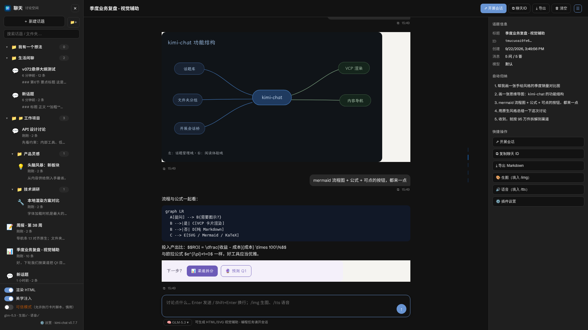
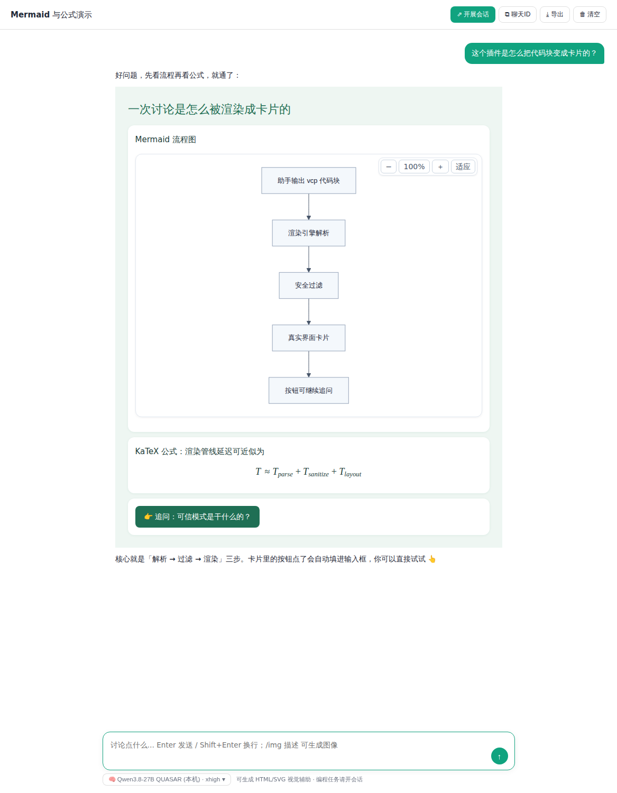
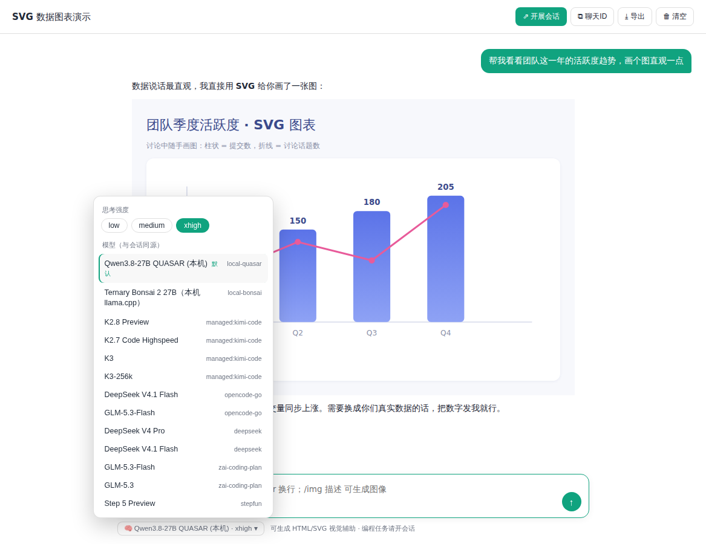

# 💬 kimi-chat

**English** | [简体中文](README.zh-CN.md)

> A **Discussion Space** plugin for [Kimi Code CLI](https://www.kimi.com/code/docs/en/) Web UI (`kimi web`) — a full-screen chat module for *talking through problems*, with 🎨 VCP visual rendering (HTML/SVG/Mermaid/KaTeX cards), fully decoupled from coding sessions.

[](LICENSE)
[](CHANGELOG.md)

---

## ✨ What is it?

Kimi Code sessions are for **coding**. kimi-chat adds a separate place for **thinking**:

- 💡 Ask questions, discuss ideas, learn concepts — the assistant proactively explains with **visual cards**: SVG charts 📊, mind maps 🧠, flowcharts, comparison tables, formulas
- 🗂️ Your own **topic library**, independent from sessions — create, search, pin, rename, export at will
- 🔗 Bridge back to coding when ready: one click to **spin off a real session** carrying the topic's context

It also embeds the **VCP (Visual Card Protocol)** renderer adapted from [dsh-raw-html](https://github.com/plolpl789/dsh-raw-html), so agents in regular sessions can output visual cards too.

## 📸 Screenshots

| 📊 Hand-drawn SVG charts | 🧠 Mind maps |
|---|---|
|  |  |

| 📈 Mermaid + KaTeX + interactive buttons | 🎛️ Model & thinking-effort picker |
|---|---|
|  |  |

## 🚀 Features

### ① 💬 Sidebar「聊天」button → full-screen Discussion Space

- A new **「聊天」button** in the Web UI sidebar opens a full-screen module (`#kc-chat` route, survives refresh, `Esc` to exit)
- Layout mirrors the session window: topic rail on the left, chat area on the right — a **fluid column (up to 1500px)** where assistant cards stretch full width and align flush with user bubbles at any window size or zoom; composer spans the same column
- **Content-summary nav strip**: a minimap of ticks along the right edge of the message list — one tick per message (yours tinted), positioned proportionally, hover for an auto summary (first heading), click to jump, active tick follows scrolling
- **Right info rail**: topic info / auto outline (click to locate) / quick actions; toggleable, auto-hides <1500px
- Plugin **settings tab** inside kimi web Settings (answer style presets ×5, color mode, think collapse, image/TTS providers, system prompt); thinking streams collapse into a fold instead of flooding the chat
- **Discussion-first system prompt**: the assistant answers with ` ```vcp ` cards — HTML/SVG diagrams, mind maps, mermaid charts, KaTeX formulas, clickable follow-up buttons

### ② 🗂️ Topic management (independent from sessions)

- ➕ New / 🔍 search / 📌 pin / ✏️ rename (double-click works too) / 🗑️ delete / 🧹 clear / 🎨 auto icon / ⬇️ export Markdown
- Records stored as plain JSON in `~/.kimi-code/kimi-chat/topics/<id>.json` — easy to back up, and agents can `Read` them directly
- **⇗ 开展会话**: one click opens a real Kimi Code session pre-filled with the topic context — discussion → deep research
- **⧉ 复制聊天ID / 📋 复制话题引用**: paste the topic ID anywhere to reference it

### ③ 🎛️ Model & thinking-effort picker (same source as sessions)

- The local service parses `~/.kimi-code/config.toml`'s model registry — **the same model list as your sessions**
- Pick any model + thinking effort (low/medium/...) per topic; remembered per topic, never touches your CLI global default
- Falls back to the CLI `default_model` when unchosen; can be overridden with any OpenAI-compatible endpoint

### ④ 🎨 VCP visual rendering (adapted from dsh-raw-html)

- Agents output ` ```vcp ` blocks (a complete HTML doc rooted at `<div id="vcp-root">`) and they render as **real UI**
- 📈 **Mermaid** diagrams with zoom/pan toolbar, 🧮 **KaTeX** formulas (`$$` / `\[` / `\(`, price-safe single `$`)
- 🔘 In-card buttons `onclick="input('...')"` auto-fill and send follow-ups
- 🔤 7 bundled open-source fonts (LXGW WenKai & friends, OFL), declarative `data-vcp-preset` color engine
- 🎓 A bundled `vcp-design` Skill teaches agents the design system (12 style libraries)
- Three toggles: **Render HTML** (on), **Aesthetic injection** (on), **Trusted mode** (off — card scripts stay inert)

### ⑤ 🖼️🔊 Configurable generation providers (image + speech)

- `/img <description>` generates images, `/tts <text>` generates speech — both via **generic provider configs** (endpoint format is MiniMax-API-compatible; point them at any compatible service)
- Two independent providers: `image{base_url,api_key,model,path}` and `tts{base_url,api_key,model,voice,path}`
- Keys stay server-side (`~/.kimi-code/kimi-chat/config.json`, mode 600), never sent to the browser

### ⑥ 📁 Bonus: "New folder" in the workspace picker

- The *Add workspace* dialog gains a **新建文件夹** button — create a directory in place, with validation and friendly errors

> 💡 **Recommended entry (required for newer kimi web with CSP):** open the UI via the unified entry **`http://<host>:58931/`** (append your token). The local service reverse-proxies the whole Web UI (WebSocket included), so the page and the chat API share one origin and newer CSP versions can't block it. Remote/LAN access works the same way — no SSH tunnel needed.

## 📦 Installation

Requires Node.js on the machine.

```bash
# 1) Install the plugin in Kimi Code TUI:
/plugins install /path/to/kimi-chat
/reload

# 2) Patch the Web UI (chat button + renderer) and start the watchdog + local service:
node ~/.kimi-code/plugins/managed/kimi-chat/installer/install.cjs

# 3) Hard-refresh the browser (Ctrl+F5) — no need to restart kimi web
```

Chat works out of the box (follows your CLI default model). For `/img` and `/tts`, fill in your generation provider keys in `~/.kimi-code/kimi-chat/config.json` (see `config.json.example`).

## ⚙️ Configuration

`~/.kimi-code/kimi-chat/config.json` (auto-created, mode 600):

| Field | Default | Description |
|---|---|---|
| `chat_base_url` | (empty) | Override chat backend with any OpenAI-compatible endpoint; empty = follow CLI `default_model` |
| `chat_api_key` / `chat_model` | (empty) | Credentials/model for the override endpoint |
| `image` | `{base_url,api_key,model,path}` | 🖼️ Image generation provider (MiniMax-API-compatible endpoint format) |
| `tts` | `{base_url,api_key,model,voice,path}` | 🔊 Speech generation provider (`t2a_v2`-compatible) |
| `port` | `58931` | Local service port |
| `bind` | (empty) | `0.0.0.0` when a `server.token` exists (auth-protected, remote-browser friendly), else `127.0.0.1` |

## 🛡️ Self-healing (Kimi Code restores patched files on startup)

| Layer | Mechanism |
|---|---|
| 🐕 **Watchdog** (primary) | Background process re-applies the Web UI patch every 3s and keeps assets in sync with the plugin version |
| 🪝 **Hook** (backup) | `SessionStart` / `SessionHeartbeat` hooks run `installer/heal.cjs`, which also revives the watchdog |

```bash
node <plugin>/installer/watch.cjs status   # check
node <plugin>/installer/watch.cjs stop     # stop
```

🔐 **Security**: the local service requires the same Bearer token as `kimi web` (`~/.kimi-code/server.token`); without a token file it binds to loopback only.

## 🗑️ Uninstall

```bash
node <plugin>/installer/uninstall.cjs   # stop watchdog + restore Web UI
/plugins remove kimi-chat               # in TUI
```

## 🧪 Tests

110 checks across 6 suites: unit (32) + service (15) + heal (10) + browser regression (14) + security (13) + folder picker (26).

```bash
node tests/unit.test.mjs
NODE_PATH=<playwright node_modules> node tests/regression-browser.cjs
```

## 🙏 Acknowledgements

- **[dsh-raw-html](https://github.com/plolpl789/dsh-raw-html)** by [@plolpl789](https://github.com/plolpl789) — the VCP visual-rendering engine, font assets, and design language in this project are adapted from their excellent open-source work (MIT, see [vendor-LICENSE-dsh-raw-html](vendor-LICENSE-dsh-raw-html)). Huge thanks! ❤️
- Built with [KaTeX](https://katex.org/), [Mermaid](https://mermaid.js.org/), and LXGW WenKai fonts (OFL).

## 📄 License

MIT © cx2002302-lang
