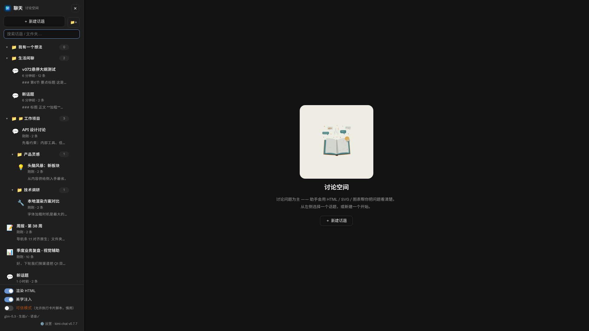
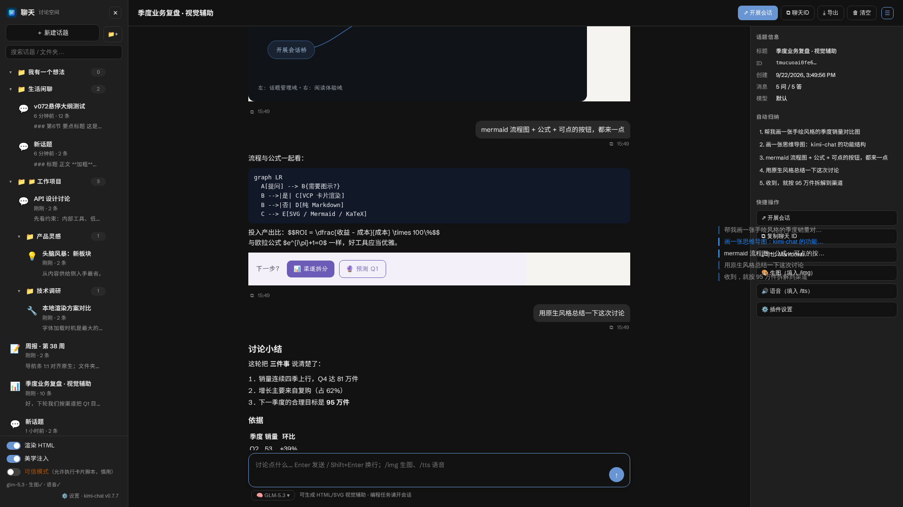
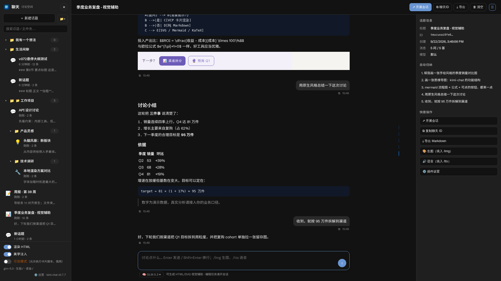

# 💬 kimi-chat

[English](README.md) | **简体中文**

> 给 [Kimi Code CLI](https://www.kimi.com/code/docs/en/) 的 Web UI（`kimi web`）加一个**「讨论空间」**——以讨论问题为主的全屏聊天模块，🎨 支持 VCP 视觉渲染（HTML/SVG/Mermaid/KaTeX 卡片），与会话系统完全解耦。

[](LICENSE)
[](CHANGELOG.md)

---

## ✨ 这是什么？

Kimi Code 的会话是用来**写代码**的；kimi-chat 给你一个专门**想清楚问题**的地方：

- 💡 提问、讨论、学概念——助手会主动用**视觉卡片**讲给你听：SVG 图表 📊、思维导图 🧠、流程图、对比表格、公式
- 🗂️ 属于你自己的**话题库**，与会话互不干扰——新建、搜索、置顶、重命名、导出，随心所欲
- 🔗 讨论透了想动手？一键**开展会话**，把话题上下文带进真实会话深入研究

同时内置了适配自 [dsh-raw-html](https://github.com/plolpl789/dsh-raw-html) 的 **VCP 视觉通感渲染引擎**——普通会话里的 agent 也能输出视觉卡片。

## 📸 实拍截图

| 📊 手绘 SVG 数据图表 | 🧠 SVG 思维导图 |
|---|---|
|  |  |

| 📈 Mermaid + KaTeX + 可交互按钮 | 🗂️ 嵌套话题文件夹 |
|---|---|
|  |  |

| 🧭 内容导航条（悬停展开） | 💬 原生会话观感 |
|---|---|
|  |  |

## 🚀 功能一览

### ① 💬 侧边栏「聊天」按钮 → 全屏讨论空间

- Web UI 侧边栏新增**「聊天」按钮**，点击进入全屏模块（`#kc-chat` 路由，刷新可恢复，`Esc` 退出）
- 布局复刻会话窗口：左侧话题栏 + 主聊天区——**860px 居中内容栏**（kimi 原生观感），助手回复与用户气泡栏内右缘对齐，任意窗口尺寸/缩放都对齐；底部 composer 同栏宽
- **原生会话观感**：配色取自 kimi web 自有 `--ms-*` 调色板，正文 Schibsted Grotesk + Noto Sans SC 14px/22px，代码 JetBrains Mono，用户气泡中性灰，每条消息带 ⧉复制 + 时间戳 meta 行；答复默认原生无卡片框（5 种排版预设仍可在设置中选择）
- **内容导航条——1:1 复刻 kimi 原生 conversation-toc**（实机采样原生 DOM 与样式）：消息区右缘一条 13px 细竖条列，每条提问一根 3×14px 圆角竖条（当前条 18px 高、主题蓝不透明）；悬停 75px 热区 0.25s 意图延迟后标签滑出（13px、右对齐、最宽 220px，过渡曲线与原生一致的 `cubic-bezier(0.16,1,0.3,1)`）；行悬停文字变亮、竖条不透明；点击跳转、当前项跟随滚动高亮；窄窗口自动隐藏
- **全模块隐藏滚动条**（滚动照常可用），视觉与原生一致不突兀
- **右侧信息栏**：话题信息 / 自动归纳（点击定位）/ 快捷操作；可开关，<1500px 自动隐藏
- kimi web「设置」内置**插件设置页签**（答复样式预设 ×5、配色模式、思考折叠、生图/TTS provider、系统提示词）；思考流折叠收纳，不再刷屏
- **讨论为主的系统提示词**：助手用 ` ```vcp ` 卡片回答——HTML/SVG 示意图、思维导图、mermaid 图表、KaTeX 公式、可点击的追问按钮

### ② 🗂️ 话题管理（与会话解耦）

- ➕ 新建 / 🔍 搜索 / 📌 置顶 / ✏️ 重命名（双击标题也行）/ 🗑️ 删除 / 🧹 清空 / 🎨 生成图标 / ⬇️ 导出 Markdown
- 📁 **嵌套文件夹**：话题可分组进多级文件夹——新建（📁+）/重命名/删除（其中聊天自动上移到父级，不丢数据）/折叠状态持久化；可拖拽移入，也可用「移动到…」菜单；文件夹显示计数；搜索框按标题/预览过滤，文件夹名命中时其内聊天一并显示。数据存于 `~/.kimi-code/kimi-chat/folders.json`
- 记录以纯 JSON 存于 `~/.kimi-code/kimi-chat/topics/<id>.json`——方便备份，agent 也能直接 `Read`
- **⇗ 开展会话**：一键新建真实会话并自动带上话题上下文——讨论 → 深入研究的桥
- **⧉ 复制聊天ID / 📋 复制话题引用**：ID 可粘贴到任何地方引用

### ③ 🎛️ 模型与思考强度选择（与会话同源）

- 本地服务解析 `~/.kimi-code/config.toml` 的模型注册表——**和会话用的是同一个模型清单**
- 每个话题可独立选择模型 + 思考强度（low/medium/…），按话题记忆，不影响 CLI 全局默认
- 不选则跟随 CLI `default_model`；也可在配置里覆盖为任意 OpenAI 兼容端点

### ④ 🎨 VCP 视觉渲染（适配自 dsh-raw-html）

- agent 输出 ` ```vcp ` 代码块（以 `<div id="vcp-root">` 为根的完整 HTML），**渲染为真实界面**
- 📈 **Mermaid** 图表（带缩放/平移工具栏）、🧮 **KaTeX** 公式（`$$`/`\[`/`\(`，价格场景 `$` 不误判）
- 🔘 卡片按钮 `onclick="input('...')"` 点击自动填入并发送
- 🔤 内置 7 款开源字体（文楷/黑体等，OFL）+ `data-vcp-preset` 声明式配色引擎
- 🎓 随附 `vcp-design` Skill 设计规范（12 套风格库），agent 越画越好看
- 三个开关：**渲染 HTML**（默认开）、**美学注入**（默认开）、**可信模式**（默认关，卡片脚本不执行）

### ⑤ 🖼️🔊 可配置的生成 provider（生图 + 语音）

- 聊天里 `/img 描述` 生图、`/tts 文本` 生成语音——**通用 provider 配置**，端点格式兼容 MiniMax API，但不锁定任何厂商，可换成任意兼容服务
- 两个独立 provider：`image{base_url,api_key,model,path}` 与 `tts{base_url,api_key,model,voice,path}`
- key 只存服务端（`~/.kimi-code/kimi-chat/config.json`，600 权限），不下发浏览器

### ⑥ 📁 彩蛋：工作区选择器「新建文件夹」

- 添加工作区对话框补了一个**新建文件夹**按钮——就地建目录，带校验和友好报错

> 💡 **推荐入口（新版 kimi web 带 CSP 时必需）**：用统一入口 **`http://<主机>:58931/`**（带上 token）打开。本地服务会把整个 Web UI 反向代理（含 WebSocket），页面与聊天 API（`/kc-api/*`）天然同源，新版 CSP 拦不到；内网 IP / 远程浏览器同样适用，无需 SSH 隧道。

## 📦 安装

需要本机有 Node.js。

```bash
# 1) 在 Kimi Code TUI 中安装插件本体：
/plugins install /path/to/kimi-chat
/reload

# 2) 给 Web UI 打补丁（聊天按钮 + 渲染能力），启动看门狗 + 本地服务：
node ~/.kimi-code/plugins/managed/kimi-chat/installer/install.cjs

# 3) 强刷浏览器（Ctrl+F5）即可，无需重启 kimi web
```

聊天开箱即用（跟随 CLI 默认模型）；`/img` 生图与 `/tts` 语音需在 `~/.kimi-code/kimi-chat/config.json` 填入生成 provider 的 key（参考 `config.json.example`）。

> 🤖 **AI 一键部署**：把 [docs/DEPLOYMENT.md](docs/DEPLOYMENT.md) 丢给 AI agent 即可——含前置检查、带验证关卡的步骤、决策表和已实测的一键脚本。

## ⚙️ 配置

`~/.kimi-code/kimi-chat/config.json`（自动创建，600 权限）：

| 字段 | 默认 | 说明 |
|---|---|---|
| `chat_base_url` | （空） | 覆盖聊天后端为任意 OpenAI 兼容端点；留空 = 跟随 CLI `default_model` |
| `chat_api_key` / `chat_model` | （空） | 覆盖端的凭证与模型名 |
| `image` | `{base_url,api_key,model,path}` | 🖼️ 生图 provider（端点格式兼容 MiniMax API） |
| `tts` | `{base_url,api_key,model,voice,path}` | 🔊 语音 provider（兼容 `t2a_v2` 格式） |
| `port` | `58931` | 本地服务端口 |
| `bind` | （空） | 有 `server.token` 时为 `0.0.0.0`（认证保护，远程浏览器可连），否则 `127.0.0.1` |

## 🛡️ 自愈机制（Kimi Code 启动时会还原被补丁的文件）

| 层 | 机制 |
|---|---|
| 🐕 **看门狗**（主） | 常驻进程每 3 秒重打 Web UI 补丁，并按插件版本同步资产 |
| 🪝 **hook**（备） | `SessionStart` / `SessionHeartbeat` 触发 `installer/heal.cjs`，顺带拉起看门狗 |

```bash
node <插件目录>/installer/watch.cjs status   # 查看状态
node <插件目录>/installer/watch.cjs stop     # 停止
```

🔐 **安全**：本地服务要求与 `kimi web` 相同的 Bearer token（`~/.kimi-code/server.token`）；无 token 文件时只绑回环地址。

## 🗑️ 卸载

```bash
node <插件目录>/installer/uninstall.cjs   # 停看门狗 + 还原 Web UI
/plugins remove kimi-chat                 # TUI 内执行
```

## 🧪 测试

10 套共 204 项全绿：unit 32 + service 25 + heal 10 + 截断续写 5 + 浏览器回归 14 + 安全 13 + 文件夹选择器 26 + v0.7.2 布局 20 + v0.7.3 原生观感 12 + v0.7.4 文件夹与导航 51。

```bash
node tests/unit.test.mjs
NODE_PATH=<playwright 的 node_modules> node tests/regression-browser.cjs
NODE_PATH=<playwright 的 node_modules> node tests/v074-browser.cjs
```

## 🙏 致谢

- **[dsh-raw-html](https://github.com/plolpl789/dsh-raw-html)** by [@plolpl789](https://github.com/plolpl789)——本项目的 VCP 视觉渲染引擎、字体资产与设计语言均适配自他们优秀的开源作品（MIT，见 [vendor-LICENSE-dsh-raw-html](vendor-LICENSE-dsh-raw-html)）。万分感谢！❤️
- 基于 [KaTeX](https://katex.org/)、[Mermaid](https://mermaid.js.org/) 与文楷字体（OFL）构建。

## 📄 License

MIT © cx2002302-lang
